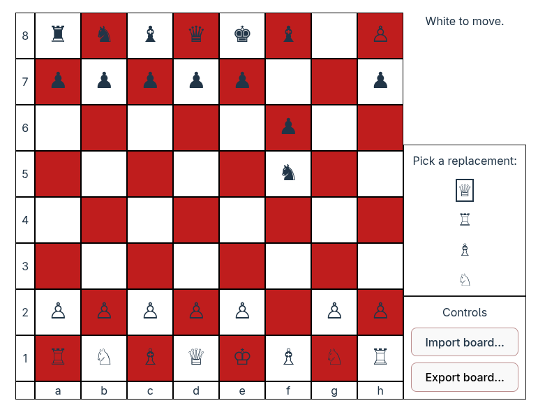

# Chess
This repository contains a two-player chess game written primarily in TypeScript and leveraging the React framework. This project was created from scratch. No vibe coding was used to create/complete this project.

# Run Instructions
1. Execute `npm install` in the base directory of this project and wait for installation to complete.
2. Run `npm run dev` in the base directory.