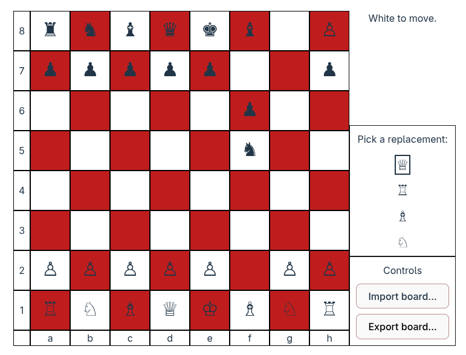

# Chess
This repository contains a two-player chess game written primarily in TypeScript and leveraging the React framework. This project was created from scratch using Vite. No vibe coding was used to create/complete this project.

# Run Instructions
For setups with Docker installed:
1. In a terminal, run `docker compose up` from the project root directory to create the Docker image and bring up the container.
2. Navigate to [http://localhost:5173/](http://localhost:5173/) in a browser.
3. Run `docker compose down` while in the project root directory to shut down the container.

-- OR --

For setups with "npm" command installed:
1. Execute `npm install` in the project root directory and wait for installation to complete.
2. Run `npm run dev` in the root directory.
3. Navigate to [http://localhost:5173/](http://localhost:5173/) in a browser.
4. Press Ctrl+C or Command+C(for Mac) in the original terminal to shut down the server.